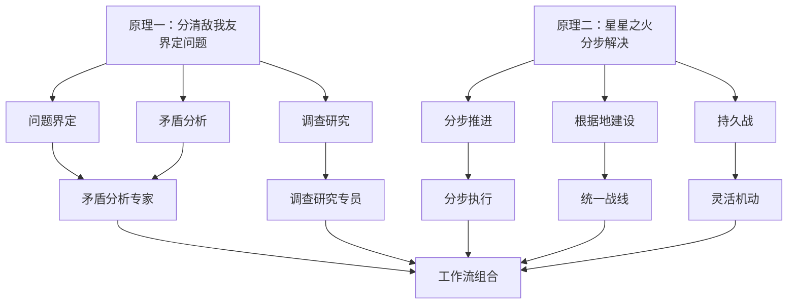

# 毛选Skill —— 星星之火，可以燎原

> "谁是我们的敌人？谁是我们的朋友？这个问题是革命的首要问题。"
> —— 《中国社会各阶级的分析》

> "星星之火，可以燎原。"
> —— 《星星之火，可以燎原》

---

## 核心原理

本skill围绕两个核心原理展开：

### 原理一：分清敌我友——界定问题

遇到问题时，首先问三个问题：
1. **这是什么性质的问题？** — 分清问题类型
2. **什么需要解决，什么不需要解决？** — 分清主次
3. **主要矛盾和根本问题是什么？** — 抓住主要矛盾

> "研究任何过程，如果是存在着两个以上矛盾的复杂过程的话，就要用全力找出它的主要矛盾。捉住了这个主要矛盾，一切问题就迎刃而解了。" —— 《矛盾论》

### 原理二：星星之火，可以燎原——分步解决

问题再庞大，也可以拆分解决：
1. **从根源入手** — 找到问题的根源
2. **一步步解决** — 积小胜为大胜
3. **波浪式推进** — 点→线→面，最终燎原

> "它是站在海岸遥望海中已经看得见桅杆尖头了的一只航船，它是立于高山之巅远看东方已见光芒四射喷薄欲出的一轮朝日" —— 《星星之火，可以燎原》

---

## 方法论体系



---

## 十八大思想武器

### 第一类：界定问题（原理一）

| 思想武器 | 核心要义 | 用途 |
|---------|---------|------|
| **矛盾分析专家** | 抓主要矛盾 | 分析问题时找出主要矛盾 |
| **调查研究专员** | 没有调查就没有发言权 | 深入了解问题的真实情况 |
| **阶级分析专家** | 分清敌我友 | 区分问题性质，划分类别 |
| **实事求是决策师** | 从实际出发 | 避免脱离实际的判断 |

### 第二类：分步解决（原理二）

| 思想武器 | 核心要义 | 用途 |
|---------|---------|------|
| **根据地建设者** | 波浪式推进 | 从点到线到面，逐步扩展 |
| **持久战战略家** | 三阶段推进 | 战略防御→相持→反攻 |
| **分步执行专家** | 积小胜为大胜 | 拆分问题，一步步解决 |
| **灵活机动战术家** | 你打你的，我打我的 | 在运动中寻找机会 |

### 第三类：整合力量

| 思想武器 | 核心要义 | 用途 |
|---------|---------|------|
| **统一战线大师** | 团结一切可团结的力量 | 分化敌人，扩大同盟 |
| **群众路线践行者** | 从群众中来，到群众中去 | 发动群众，依靠群众 |

### 第四类：自我改进

| 思想武器 | 核心要义 | 用途 |
|---------|---------|------|
| **批评与自我批评导师** | 惩前毖后，治病救人 | 审视工作，修正错误 |
| **学习改造大师** | 改造我们的学习 | 持续学习，不断进步 |
| **艰苦奋斗实干家** | 两个务必 | 保持作风，艰苦奋斗 |

### 第五类：战略保障

| 思想武器 | 核心要义 | 用途 |
|---------|---------|------|
| **独立自主开拓者** | 自力更生为主 | 建立自主能力 |
| **风险预判与危机管理** | 底线思维 | 预判风险，有备无患 |
| **文艺统战家** | 百花齐放、百家争鸣 | 文化软实力 |
| **思想政治工作者** | 政治是生命线 | 思想保证 |

---

## 四大工作流

### 工作流一：问题界定
```
调查研究 → 矛盾分析 → 问题定性 → 确定主攻方向
```
**适用场景**：遇到新问题，需要分清性质和主次时

### 工作流二：分步攻坚
```
找出根源 → 拆分问题 → 分步解决 → 积小胜为大胜
```
**适用场景**：问题庞大，需要分步解决时

### 工作流三：迭代优化
```
调查现状 → 分析矛盾 → 制定方案 → 执行检验 → 复盘改进
```
**适用场景**：持续改进已有方案时

### 工作流四：统一战线
```
分析力量 → 团结友军 → 孤立敌人 → 扩大战果
```
**适用场景**：需要整合资源、扩大力量时

---

## 核心口诀

> "没有调查，没有发言权。" —— 《反对本本主义》

> "研究任何过程，如果是存在着两个以上矛盾的复杂过程的话，就要用全力找出它的主要矛盾。捉住了这个主要矛盾，一切问题就迎刃而解了。" —— 《矛盾论》

> "星星之火，可以燎原。" —— 《星星之火，可以燎原》

> "从群众中来，到群众中去。" —— 《关于领导方法的若干问题》

> "下定决心，不怕牺牲，排除万难，去争取胜利。" —— 《愚公移山》

---

## 使用方式

### 安装

**Cursor：**
1. 克隆仓库到本地
2. 将项目目录加入Cursor的插件路径

**Claude Code：**
```bash
git clone https://github.com/DOIT-Ben/maoxuan-skill
cd maoxuan-skill
claude --plugin-dir .
```

### 手动命令入口

```
/contradiction-analysis   矛盾分析
/investigation          调查研究
/class-analysis         阶级分析
/seeking-truth          实事求是
/base-area             根据地建设
/protracted-war         持久战
/flexible-tactics      灵活机动
/united-front          统一战线
/mass-line             群众路线
/criticism             批评与自我批评
/hard-struggle         艰苦奋斗
/self-reliance         独立自主
/risk-management        风险预判
/cultural-united-front 文艺统战
/ideological-work      思想政治工作
/learning              学习改造
/workflows             工作流组合
```

---

## 项目结构

```
maoxuan-skill/
├── .cursor-plugin/plugin.json
├── .claude-plugin/plugin.json
├── hooks/                       # Session注入系统
├── commands/                     # 17个手动命令入口
├── skills/                       # 18个Skill（17个手动+1个自动）
└── docs/                         # 扩展文档
```

---

> "下定决心，不怕牺牲，排除万难，去争取胜利。"

**让毛泽东思想在新时代绽放更加璀璨的光芒！**